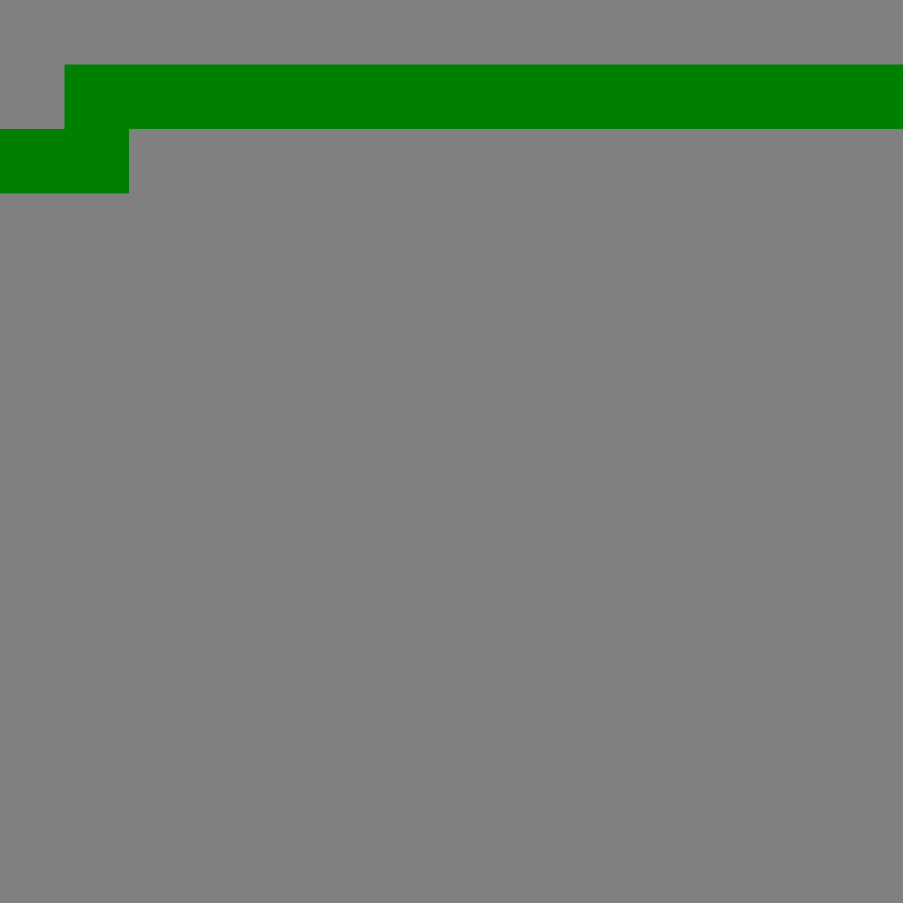
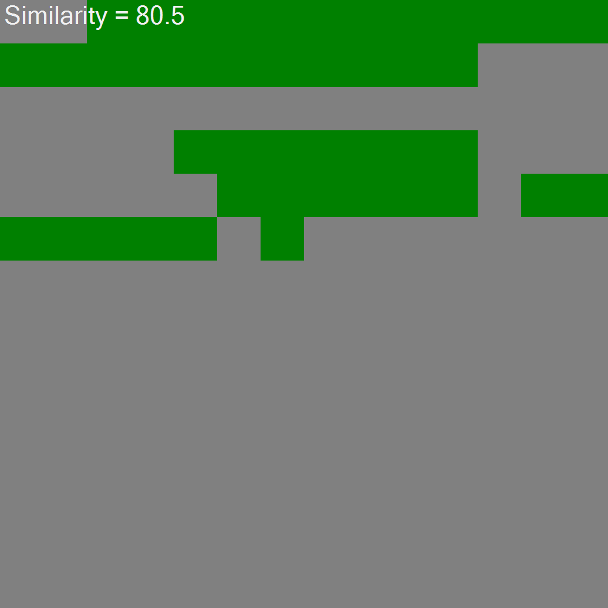
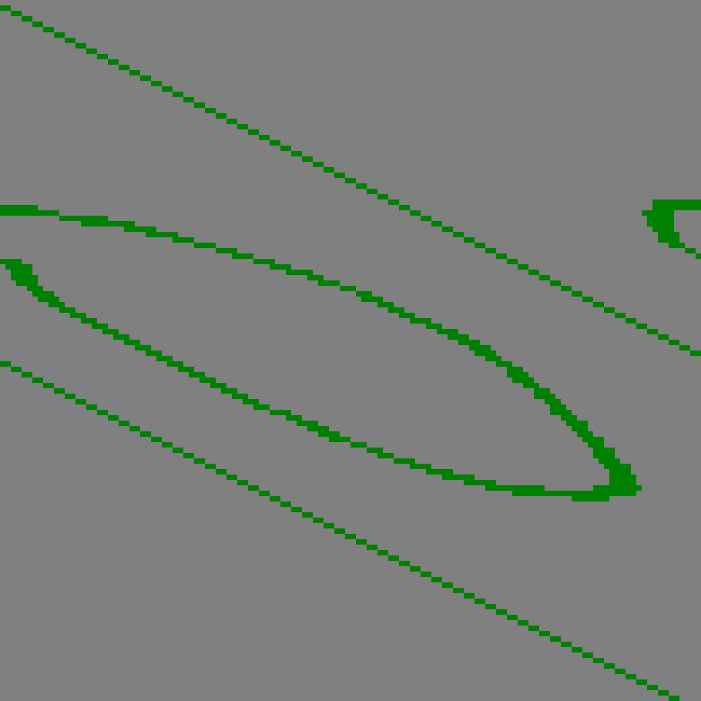
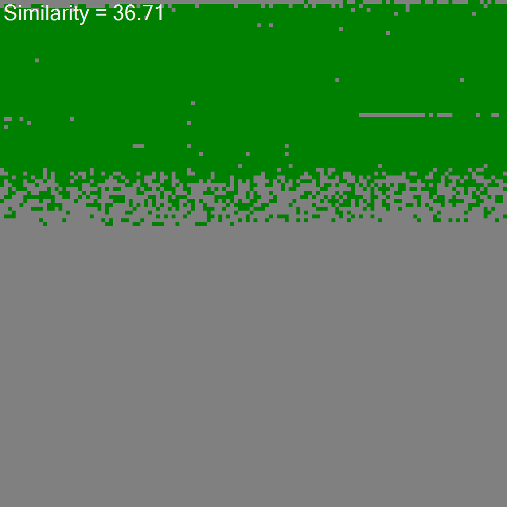

# ML 23/24-04 Implement the Spatial Pooler SDR Reconstruction 

# Implementation
The project Implement the Spatial Pooler SDR Reconstruction is developed using C# .Net Core in Microsoft Visual Studio 2022 IDE (Integrated Development Environment) and is used as a reference model to understand the functioning of the reconstruction method. 
  
Methods added:  
# Create a method RunRustructuringExperiment()
Snippet of method added in-order to achieve the reconstruct functionality for integer input.
[Refer code in Git for RunRustructuringExperiment method](https://github.com/MusabChishti/neocortexapi/blob/cbc59dfd55ff85788915e9f2ac7d262aba9281a5/source/Samples/NeoCortexApiSample/SpatialPatternLearning.cs#L277)
~~~csharp
         private void RunRustructuringExperiment(SpatialPooler sp, EncoderBase encoder, List<double> inputValues)
        {
            // Create a directory to save the bitmap output.
            string outFolder = nameof(RunRustructuringExperiment);

            // Check if the directory exists, delete it if it does, then recreate it.
            if (Directory.Exists(outFolder))
            {
                Directory.Delete(outFolder, true);
            }
            Directory.CreateDirectory(outFolder);
~~~
      

  
  Steps:   

1)Clone this repository to your local machine.

2)Ensure you have the necessary dependencies installed, including:

Daenet.ImageBinarizerLib
LearningFoundation
NeoCortex
3)Open the solution in your preferred C# IDE.

4)Build the solution to ensure all dependencies are resolved.

5)Before running the experiment, make sure to check for the input image path and specify the output folder where the generated images will be saved.

	Input Image Path: Ensure that the path to the input image is correctly specified in the code. This is typically set in the BinarImage().
	Output Folder: Specify the path to the folder where the generated images will be saved.This is typically set in the BinarImage().
	Bitmap Output Path: The bitmap images generated during the experiment will be saved in the output folder specified. You can find the generated bitmap images in the below mentioned folder after running the experiment.
	neocortexapi\source\Samples\NeoCortexApiSample\bin\Debug\net8.0\RunRustructuringExperiment.
6)Run the SpatialPatternLearning class to start the experiment.

7)Follow the on-screen prompts to choose between integer and image inputs.

8)Review the output to see the results of the experiment, including similarity metrics.
Use above code to call serialization and StreamWriter helps to save it to any text file .

# Create a method RunRustructuringExperimentImage()

Snippet of method added in-order to achieve the reconstruct functionality for Image input.
[Refer code in Git for RunRustructuringExperimentImage method](https://github.com/MusabChishti/neocortexapi/blob/cbc59dfd55ff85788915e9f2ac7d262aba9281a5/source/Samples/NeoCortexApiSample/SpatialPatternLearning.cs#L408C29-L408C60)
~~~csharp
         private static void RunRustructuringExperimentImage(SpatialPooler sp1)
        {
            // Create a directory to save the bitmap output.
            string outFolder = nameof(RunRustructuringExperiment);
            Directory.Delete(outFolder, true); // Delete existing directory if exists
            Directory.CreateDirectory(outFolder); // Create new directory

~~~

# Create a method BinarImage()

Snippet of method added in-order to Binarize Image.
[Refer code in Git for BinarImage method](https://github.com/MusabChishti/neocortexapi/blob/cbc59dfd55ff85788915e9f2ac7d262aba9281a5/source/Samples/NeoCortexApiSample/SpatialPatternLearning.cs#L359C30-L359C42)
~~~csharp
         private static int[] BinarImage()
        {
            // Binarize the image (Assuming this function works correctly)
            NeoCortexUtils.BinarizeImage("D:\\Code-X\\Capture.PNG", "D:\\Code-X\\abcs.txt", 130, "");

            // Path to the text file containing binary data
            string file = "D:\\Code-X\\abcs.txt";
~~~
Before running the experiment, make sure to check for the input image path and specify the output folder where the generated images will be saved.

	Input Image Path: Ensure that the path to the input image is correctly specified in the code. This is typically set in the BinarImage().
	Output Folder: Specify the path to the folder where the generated images will be saved.This is typically set in the BinarImage().

## Input and Reconstructed Output 
Sample of a input and reconstructed output bitmap: The bitmap images generated during the experiment will be saved in the output folder specified. You can find the generated bitmap images in the below mentioned folder after running the experiment.
	neocortexapi\source\Samples\NeoCortexApiSample\bin\Debug\net8.0\RunRustructuringExperiment

  

  
  
## Testing

The Below figure 1 shows a snippet from input of integer 8. Figure 2 is reconstructed output image.

()

The Below figure 3 shows a snippet from input of Image. Figure 4 is reconstructed output image.

#
Team Name : CodeX

Team Members: Nithin Benny, Musab Chishti, Abdul Rehman and Adeleh Behboodi.  

Link to Project:  [Team CodeX - Group Branch ](https://github.com/MusabChishti/neocortexapi/tree/CodeX)  
Forked from: https://github.com/ddobric/neocortexapi

# **Outcome of Project**
Objective of this project is implementing Reconstruct functionality for Integer and Image inputs.

The outputs are validated and demonstrated with help of Bitmap and Similarity.  
  - [x] Drawing bitmap using DrawBitmap() for input and output. 
  - [x] Finding the similarity between input and output.

#### Team Contribution Links:  
Consolidated commits and changes of all members available at -->  [ Team CodeX Branch ](https://github.com/MusabChishti/neocortexapi/commits/CodeX/)

